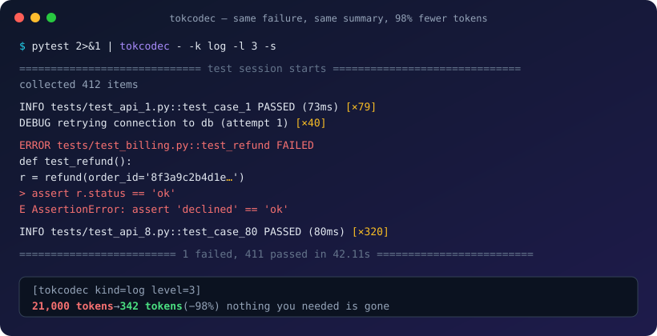
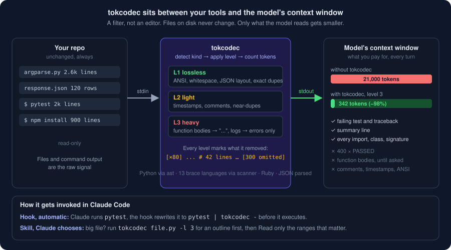

<p align="center">
  
</p>

<h1 align="center">tokcodec</h1>

<p align="center">
  <b>A codec for LLM context.</b><br>
  Video codecs throw away what the eye can't see. tokcodec throws away what the model doesn't need.<br>
  A 21,000-token test run becomes 342 tokens. The failure is still there.
</p>

<p align="center">
  <a href="https://lnxinc.com"><picture><source media="(prefers-color-scheme: dark)" srcset="assets/lnx-logo-dark.png"></picture></a><br>
  <sub>Built and maintained by <a href="https://lnxinc.com">LNX Inc.</a> · free of charge for everyone, forever · MIT licensed</sub>
</p>

<p align="center">
  <a href="https://github.com/lnxinc/tokcodec/actions/workflows/ci.yml"></a>
  <a href="https://pypi.org/project/tokcodec/"></a>
  <a href="https://www.npmjs.com/package/tokcodec"></a>
  
  
</p>

---

## The problem is headroom, not just money

Every test run, install log, and 2,000-line file your AI coding agent reads lands in its context window. Most of it is filler: 400 lines of `PASSED`, JSON that is half whitespace, function bodies it never needed. The window fills, `/compact` fires, and the thread loses the plot mid-task. If you pay per token it also costs money, but on a flat plan the real price is the context you no longer have.

tokcodec makes those tool results small before they land, in graded levels, and always tells the model what it left out.

## Try it in 10 seconds

```bash
npx tokcodec why path/to/any/file.py     # see the token math for yourself
npx tokcodec install                      # wire it into Claude Code (skill + hooks)
```

No Python on the machine? Fine. The launcher uses `uvx` or `pipx` if you have them, and otherwise downloads a private copy of [uv](https://docs.astral.sh/uv/) once (about 15 MB), which brings its own Python. Prefer Python tooling directly? `uvx tokcodec ...` or `pipx run tokcodec ...` do the same. Permanent install: `uv tool install tokcodec` / `pipx install tokcodec`.

Claude Code users can also install it as a plugin, which needs no settings merge:

```
/plugin marketplace add lnxinc/tokcodec
/plugin install tokcodec@lnxinc
```

## Why not just gzip it?

Because bytes and tokens are different currencies. A BPE tokenizer turns high-entropy text into roughly one token per one or two characters, and the model can't inflate gzip in its head anyway. Every byte-level trick makes the token count *worse*:

<!-- WHY -->
| variant | bytes | tokens | vs original | model can read it? |
|---|---:|---:|---:|---|
| original | 12,873 | 3,159 | +0% | yes |
| gzip + base64 | 4,876 | 3,294 | +4% | no, the model cannot inflate gzip |
| vowels removed | 11,075 | 3,908 | +24% | partly, and it guesses wrong |
| tokcodec L1 | 12,866 | 3,159 | +0% | yes, lossless |
| tokcodec L2 | 7,996 | 2,105 | -33% | yes, comments gone |
| tokcodec L3 | 1,957 | 599 | -81% | yes, bodies gone (outline) |
<!-- /WHY -->

Token compression has to remove *information the reader doesn't need*, not bytes. That is what tokcodec does, in graded levels.

## Benchmark

Real files, reproducible by anyone with `uv run python bench/run.py` (proxy tokenizer, no API key needed). Details in [`bench/RESULTS.md`](bench/RESULTS.md). The same table counted with Anthropic's `count_tokens` is in [`bench/RESULTS-exact.md`](bench/RESULTS-exact.md): Claude's tokenizer counts about 1.5× more tokens on code, and the savings percentages agree within three points (−45% / −80% exact vs −48% / −83% proxy at levels 2 and 3).

<!-- BENCH -->
| file | kind | what it is | raw tokens | L1 lossless | L2 light | L3 heavy |
|---|---|---|---:|---:|---:|---:|
| `Arr.php` | php | Laravel `Collections/Arr.php` | 6,008 | 6,008 (−0%) | 3,458 (−42%) | 933 (−84%) |
| `Joiner.java` | java | Guava `Joiner.java` | 4,373 | 4,373 (−0%) | 2,007 (−54%) | 1,180 (−73%) |
| `LinkedList.cs` | csharp | .NET runtime `LinkedList.cs` | 3,599 | 3,599 (−0%) | 3,354 (−7%) | 1,495 (−58%) |
| `Strings.kt` | kotlin | Kotlin stdlib `text/Strings.kt` | 13,964 | 13,963 (−0%) | 7,449 (−47%) | 4,181 (−70%) |
| `api_response.json` | json | pretty-printed REST response, 120 records | 11,138 | 6,983 (−37%) | 6,983 (−37%) | 493 (−96%) |
| `argparse.py` | python | CPython stdlib `argparse.py` | 21,198 | 21,195 (−0%) | 15,688 (−26%) | 3,501 (−83%) |
| `decoder.py` | python | CPython stdlib `json/decoder.py` | 3,159 | 3,159 (−0%) | 2,105 (−33%) | 599 (−81%) |
| `linkhash.h` | c | json-c `linkhash.h` | 3,197 | 3,197 (−0%) | 907 (−72%) | 893 (−72%) |
| `npm_module.js` | js | `glob/dist/esm/walker.js` from npm | 2,851 | 2,851 (−0%) | 2,520 (−12%) | 520 (−82%) |
| `pytest_run.log` | log | pytest run, 412 tests, ANSI colour, timestamps, 1 failure | 15,089 | 15,073 (−0%) | 231 (−98%) | 231 (−98%) |
| `set.rb` | ruby | Ruby stdlib `set.rb` | 7,310 | 7,310 (−0%) | 2,795 (−62%) | 935 (−87%) |
| `strings_builder.go` | go | Go stdlib `strings/builder.go` | 865 | 865 (−0%) | 433 (−50%) | 249 (−71%) |
| `vec_deque_iter.rs` | rust | Rust `alloc` `vec_deque/iter.rs` | 1,577 | 1,577 (−0%) | 1,350 (−14%) | 965 (−39%) |
| **total** | | | **94,328** | **90,153 (−4%)** | **49,280 (−48%)** | **16,175 (−83%)** |
<!-- /BENCH -->

## Fidelity: does the model still get it right?

Token savings alone is a party trick. The question is whether a model reading the compressed version still answers correctly. [`bench/fidelity/`](bench/fidelity) holds 104 questions with checkable answers, 8 per sample, deliberately including questions that levels 2 and 3 are *expected* to fail (comment contents, logic inside a collapsed body). The harness asks a model each question at every level, grades the answers, and writes every wrong one, unedited, to [`bench/FIDELITY.md`](bench/FIDELITY.md).

Run it yourself with an API key:

```bash
uv run --extra bench python bench/fidelity/run.py --estimate   # cost first, no calls
uv run --extra bench python bench/fidelity/run.py              # ~$5 on Sonnet 5, cached after
```

## What it never removes

The safety contract, in plain terms:

- **Level 1 is lossless in meaning.** Whitespace, ANSI codes, JSON layout, and exact duplicate lines only. Safe for anything, including edits.
- **Every cut is marked.** `[×80]`, `...  # 42 lines`, `{ /* … 12 lines */ }`, `… [300 lines omitted]`. The model always knows where to look deeper.
- **Failures survive.** The log codec keeps the head, the tail, and every line matching error, fail, exception, traceback, warning, or summary patterns, with a line of context.
- **Outlines keep the map.** Imports, classes, every signature, the first docstring line. Python outlines are valid Python; JSON stays valid JSON.
- **Edits read raw.** Levels 2 and 3 are for reading. The bundled skill tells Claude to read losslessly before editing, so `old_string` matches never fail on compressed text.
- **Hooks fail open.** If `tokcodec` is missing or crashes, the original output and exit code are shown unchanged. `TOKCODEC_HOOK_DISABLE=1` turns everything off instantly.
- **No telemetry, no network calls,** except the optional `--exact` token count you ask for.

## Levels

| Level | Name | What happens | Edit against it? |
|---|---|---|---|
| 0 | raw | nothing | yes |
| 1 | **lossless** | ANSI codes, `\r`, trailing whitespace, blank-line runs, JSON re-serialised compact, exact duplicate log lines → `[×N]` | yes |
| 2 | **light** | + timestamps and long hex ids out of logs, near-duplicates collapsed, comments and docstrings out of code | no (whitespace differs) |
| 3 | **heavy** | + function bodies → `...  # N lines` (Python) or `{ /* … N lines */ }` (brace languages), indentation shrunk, logs cut to head + tail + every error/warning line with context, JSON arrays capped at 8 items and strings at 200 chars | no |

## Supported languages

Outlines (level 3) for 14 languages, comment stripping for 21, plus JSON, log, diff and prose codecs. `tokcodec langs` prints the table. Detection is by extension or filename first, then by content for pasted snippets.

<details>
<summary>Full table</summary>

| Kind | Languages | Comments out (L2) | Outline (L3) | How |
|---|---|:---:|:---:|---|
| `python` | Python | ✓ | ✓ | `ast` + `tokenize`; skeletons are valid Python, first docstring line kept |
| `js` | JavaScript, TypeScript, JSX, TSX | ✓ | ✓ | brace scanner; arrow functions and class methods included |
| `go` | Go | ✓ | ✓ | brace scanner |
| `rust` | Rust | ✓ | ✓ | brace scanner; `impl` blocks stay, `fn` bodies collapse |
| `java` | Java | ✓ | ✓ | brace scanner; generics, `throws`, annotations kept |
| `kotlin` | Kotlin | ✓ | ✓ | brace scanner |
| `csharp` | C# | ✓ | ✓ | brace scanner; Allman braces supported |
| `c` | C, C++, Objective-C | ✓ | ✓ | brace scanner; preprocessor lines kept |
| `swift` | Swift | ✓ | ✓ | brace scanner |
| `dart` | Dart | ✓ | ✓ | brace scanner |
| `scala` | Scala | ✓ | ✓ | brace scanner |
| `php` | PHP | ✓ | ✓ | brace scanner; `//`, `#` and `/* */` comments, `#[Attribute]` kept |
| `zig` | Zig | ✓ | ✓ | brace scanner |
| `ruby` | Ruby, Gemfile, Rakefile | ✓ | ✓ | `def … end` by indentation |
| `shell` | sh, bash, zsh, fish, PowerShell, Dockerfile, Makefile | ✓ | – | string-aware `#` comments |
| `config` | YAML, TOML, INI, .env, .properties | ✓ | – | string-aware `#` comments |
| `perl` | Perl, R, Elixir | ✓ | – | string-aware `#` comments |
| `sql` | SQL | ✓ | – | `--` and `/* */` comments |
| `lua` | Lua, Haskell | ✓ | – | `--` comments |
| `css` | CSS, SCSS, Less | ✓ | – | `/* */` and `//` comments |
| `markup` | HTML, XML, SVG, Vue, Svelte | ✓ | – | `<!-- -->` comments |
| `json` | JSON, JSONL | – | sampled | parsed and re-emitted; arrays capped, strings trimmed, still valid JSON |
| `log` | logs, test/build/install output | – | truncated | dedupe, timestamps out, keep head + tail + every error/warning line |
| `diff` | unified diffs | – | – | lossless text pass only |
| `text` | Markdown, reStructuredText, prose | – | – | lossless text pass only |

Anything unrecognised gets the `text` treatment, which is always safe. Want a language added? Brace languages need one line in `tokcodec/langs.py`; others need a small transform plus a test.

</details>

## Usage

```bash
tokcodec FILE                    # level 2, kind auto-detected
tokcodec FILE -l 3 -s            # heavy level, token stats on stderr
cat big.json | tokcodec - -k json -l 1
tokcodec bench src/              # savings table for a whole directory
tokcodec count FILE              # token count
tokcodec why FILE                # the gzip table above, for any file
tokcodec langs                   # supported kinds
tokcodec install [--project] [--skill-only] [--uninstall] [--dry-run]
tokcodec serve                   # MCP server over stdio (needs tokcodec[mcp])
```

Add `--exact` to count with Anthropic's `count_tokens` endpoint instead of the local proxy tokenizer. It is free and needs `ANTHROPIC_API_KEY` or an `ant auth login` profile.

### As a library

```python
from tokcodec import encode

r = encode(open("app.log").read(), level=3, kind="log")
print(r.encoded)
print(r.tokens_before, r.tokens_after, r.steps)
# 15089 231 ['lossless-text', 'log-fuzzy', 'log-truncate']   (proxy counts; --exact gives Claude's)
```

### As an MCP server

Any MCP client (Claude Code, Cursor, Zed, Claude Desktop) can call tokcodec directly:

```bash
uv tool install "tokcodec[mcp]"
claude mcp add tokcodec -- tokcodec serve
```

Tools: `read_compact(path, level, kind)`, `compact_text(text, kind, level)`, `token_count(text)`. Each result starts with a one-line header giving the kind and before/after token counts.

## Claude Code integration

Two ways in. The plugin (above) is the simplest. `tokcodec install` does the same by hand under `~/.claude/` (or `./.claude/` with `--project`). Either way you get:

1. **A skill** that teaches Claude when to reach for tokcodec instead of reading a huge file whole, and which level to use.
2. **A Bash hook** (`PreToolUse`) that rewrites noisy commands (`pytest`, `npm install`, `cargo build`, `git pull`, …) so their output is captured, compressed with `tokcodec -k log -l 3`, and handed to Claude. Claude never sees the 900 lines of dots.
3. **A Read hook** (`PreToolUse`) that stops whole-file reads above 64 KB and points Claude at `tokcodec file -l 3` for an outline, then ranged reads.

The hooks are registered as `tokcodec hook bash` and `tokcodec hook read`, nothing else: no interpreter path, no home-directory path, so the same configuration works on macOS, Linux and Windows. `tokcodec install` merges settings, never overwrites, and `--uninstall` removes exactly what was added. Knobs: `TOKCODEC_HOOK_LEVEL=2|3`, `TOKCODEC_READ_MAX_KB=64`, `TOKCODEC_HOOK_DISABLE=1`.

Using Cursor, Codex, Aider or Gemini CLI? tokcodec is a plain stdin/stdout filter. Drop the text of [`SKILL.md`](tokcodec/assets/claude_code/SKILL.md) into your agent's instructions file and pipe away, or point the agent at the MCP server.

## How it works

<p align="center">
  
</p>

Three things to know:

1. **It's a filter, not an editor.** tokcodec reads a file or a command's output and writes a shorter version to stdout. Nothing on disk changes. The compressed text exists only on its way into the model's context.
2. **It shrinks tool results, not your conversation.** In Claude Code, every command output and every file read lands in the context window. tokcodec makes those results smaller before they land. Your prompts and Claude's replies are untouched.
3. **Lossy levels are for reading.** Level 1 is safe for anything. Levels 2 and 3 change whitespace and drop detail, so an agent about to *edit* a file should read it losslessly. The bundled skill tells Claude exactly that.

Under the hood:

- **Python** goes through `ast` and `tokenize`, so a `#` inside a string is never mistaken for a comment and skeletons always parse.
- **Brace languages** (JS/TS, Go, Rust, Java, Kotlin, C#, C/C++, Swift, Dart, Scala, PHP, Zig) share one scanner that tracks strings, template literals and comments while matching braces. Control statements and type declarations are never collapsed, only function bodies.
- **Ruby** outlines `def … end` blocks by indentation.
- **Logs** dedupe on a fuzzy key (digits and durations normalised), then keep head, tail and every line matching error/fail/warn/exception/traceback/summary patterns, with one line of context.
- **JSON** is parsed and re-emitted, so output is always valid JSON.

## Honest limits

- The default counter is tiktoken's `o200k_base`, because Anthropic doesn't publish Claude's tokenizer. Measured against `count_tokens`, the proxy undercounts Claude tokens by about a third on code while the savings percentages agree within three points. Headline numbers in this README are exact; `--exact` gives you the same.
- tokcodec does not replace prompt caching. Caching makes re-sent context cheap; tokcodec makes it smaller to begin with. Use both.
- Outlines for brace languages come from a scanner, not a parser. It handles strings, comments and nested braces, but exotic syntax (Rust raw strings with `#`, C# verbatim strings with `""`) can occasionally confuse it. When it can't find a matching brace it leaves the code untouched rather than guessing.
- Level 3 loses things on purpose. The fidelity benchmark exists to show exactly which things.

## Roadmap

- [ ] Tree-sitter backend for exact outlines where the scanner falls short
- [ ] Diff-aware mode: skeleton everything except the hunks that changed
- [ ] Session-level dedupe: never send the same file twice in one conversation
- [ ] Real-task benchmark: SWE-bench-lite with and without the hooks, pass rate and total tokens
- [ ] Learned importance scoring for log lines

## Contributing

```bash
git clone https://github.com/lnxinc/tokcodec && cd tokcodec
uv sync --all-extras && make test && make bench && make smoke
```

Every transform ships with a test that proves what it *keeps*: a failure line, a signature, valid JSON. See [CONTRIBUTING.md](CONTRIBUTING.md) and [RELEASING.md](RELEASING.md). Ideas and benchmark results from your own repos are very welcome in issues.

## About

tokcodec is provided by <a href="https://lnxinc.com"><b>LNX Inc.</b></a> free of charge for everyone. No paid tier, no telemetry, no sign-up. If it saves you tokens, a star on the repo and a link back are all we ask.

<p align="center">
  <a href="https://lnxinc.com"><picture><source media="(prefers-color-scheme: dark)" srcset="assets/lnx-logo-dark.png"></picture></a>
</p>

## License

MIT © [LNX Inc.](https://lnxinc.com)
